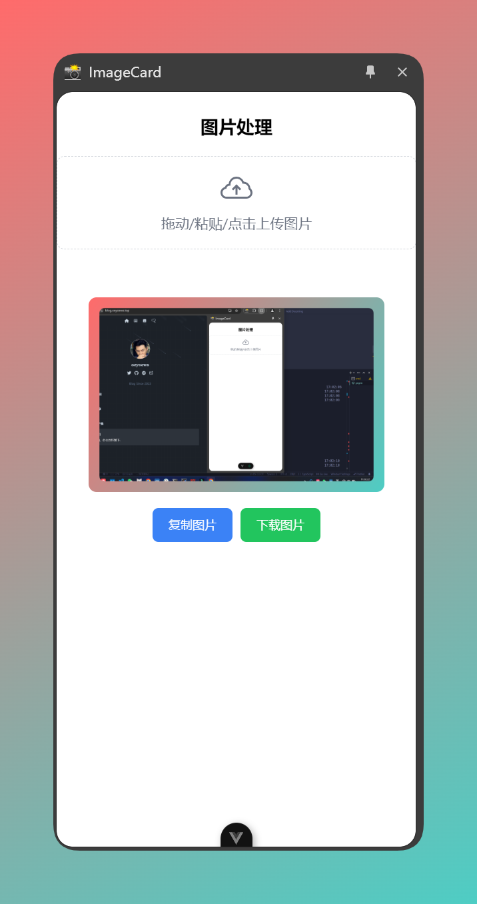

## image-card

> [!IMPORTANT]
> 此插件目前支持 Google Chrome, Edge, 暂时不会进行兼容 firefox 的适配工作.

> [!IMPORTANT]
> 此插件目前没有上架商店， 如果从本地安装或者更新遇到问题, 建议删除插件后重新安装.

<!-- * element plus, tailwindcss, wxt, vue, axios -->

## Install

* https://github.com/oeyoews/image-card/releases

## Credits

* icon: https://iconduck.com/icons/14145/markdown
* icons generator: https://alexleybourne.github.io/chrome-extension-icon-generator/